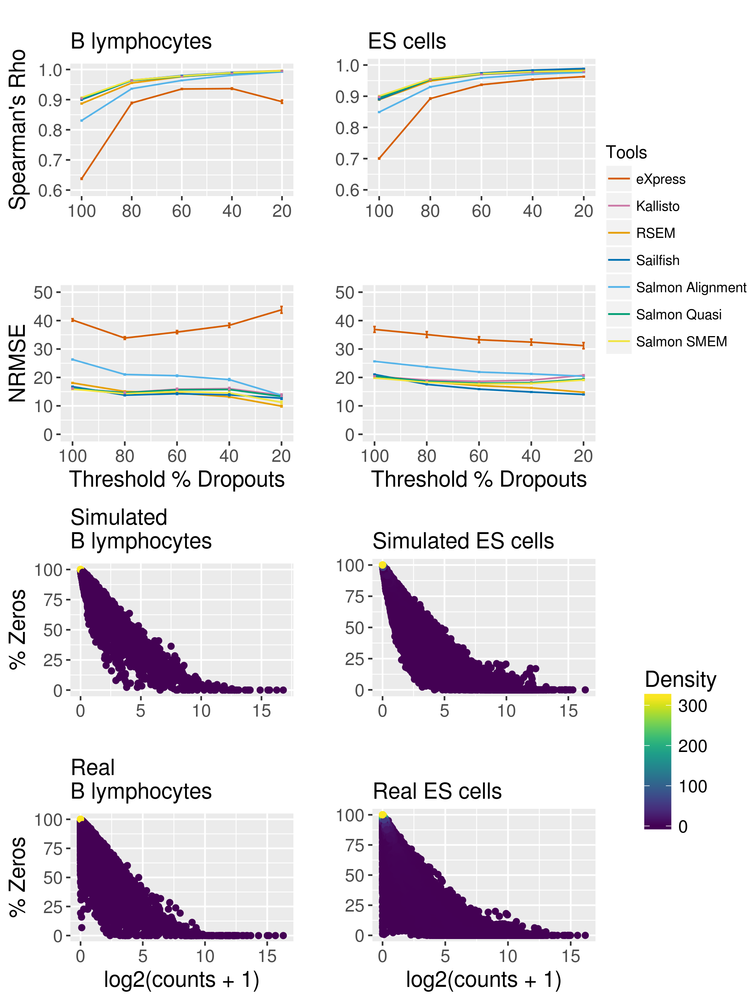
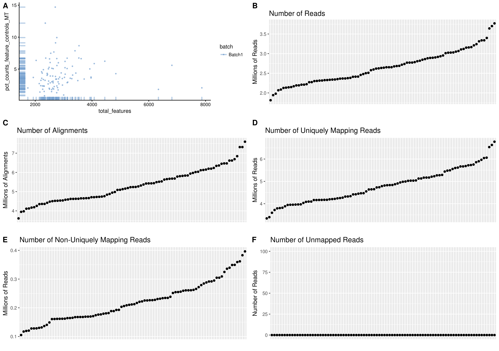
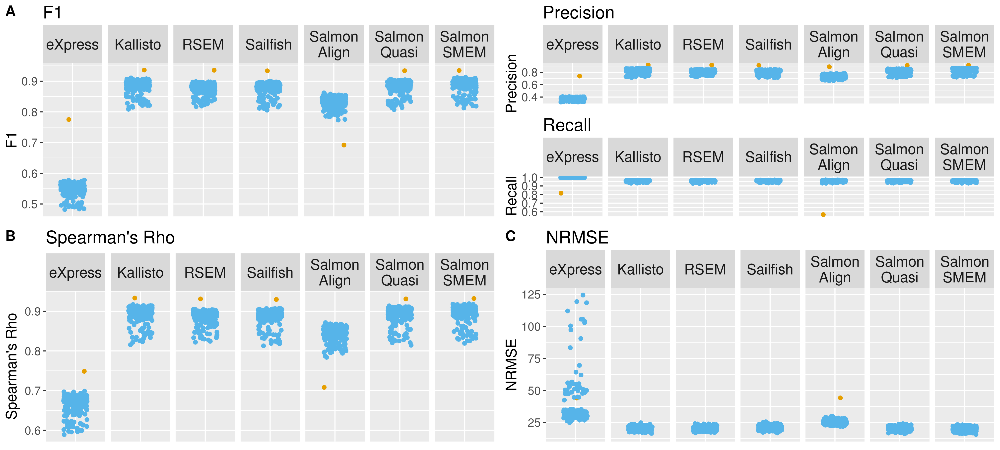

# Benchmark_Figures

Note - for data/SupplementaryFigure7.gz, data/SupplementaryFigure12.gz, data/SupplementaryFigure15.gz and data/SupplementaryFigure10_scater_object.RData, only pointer files are available due to the large size of the files. The files can also be accessed at ...

# Figure 1

* [data](data/Figure1.txt)
* [code](scripts/Figure1.R)
* [pdf](pdfs/Figure1.pdf)

# Figure 2

* [data](data/Figure2.txt)
* [code](scripts/Figure2.R)
* [pdf](pdfs/Figure2.pdf)

# Figure 3

* [data](data/Figure3.txt)
* [code](scripts/Figure3.R)
* [pdf](pdfs/Figure3.pdf)

# Figure 4a

* [data](data/Figure4a.txt)
* [code](scripts/Figure4a.R)
* [pdf](pdfs/Figure4a.pdf)

# Figure 4b

* [data](data/Figure4b.txt)
* [code](scripts/Figure4b.R)
* [pdf](pdfs/Figure4b.pdf)

# Figure 5

* [data part 1](Benchmark_Figures/data/Figure5_number_of_isoforms.txt)
* [data part 2](Benchmark_Figures/data/Figure_5_percent_exprs.txt)
* [code](scripts/Figure5.R)
* [pdf](pdfs/Figure5.pdf)

# Supplementary Figure 1

* [data part 1](Benchmark_Figures/data/SupplementaryFigure1_reads_alignment_data.txt)
* [data part 2](Benchmark_Figures/data/SupplementaryFigure1_scater_object.RData)
* [code](scripts/SupplementaryFigure1.R)
* [pdf](pdfs/SupplementaryFigure1.pdf)

# Supplementary Figure 2

* [data part 1](Benchmark_Figures/data/SupplementaryFigure2_reads_alignment_data.txt)
* [data part 2](Benchmark_Figures/data/SupplementaryFigure2_scater_object.RData)
* [code](scripts/SupplementaryFigure2.R)
* [pdf](pdfs/SupplementaryFigure2.pdf)

# Supplementary Figure 3

* [data part 1](Benchmark_Figures/data/SupplementaryFigure3_reads_alignment_data.txt)
* [data part 2](Benchmark_Figures/data/SupplementaryFigure3_scater_object.RData)
* [code](scripts/SupplementaryFigure3.R)
* [pdf](pdfs/SupplementaryFigure3.pdf)

# Supplementary Figure 4

* [data part 1](Benchmark_Figures/data/SupplementaryFigure4_reads_alignment_data.txt)
* [data part 2](Benchmark_Figures/data/SupplementaryFigure4_scater_object.RData)
* [code](scripts/SupplementaryFigure4.R)
* [pdf](pdfs/SupplementaryFigure4.pdf)

# Supplementary Figure 5

* [data part 1](Benchmark_Figures/data/SupplementaryFigure5_Kallisto.Rdata)
* [data part 2](Benchmark_Figures/data/SupplementaryFigure5_RSEM.Rdata)
* [data part 3](Benchmark_Figures/data/SupplementaryFigure5_lun2sim.Rdata)
* [data part 4](Benchmark_Figures/data/SupplementaryFigure5_lunsim.RDS)
* [data part 5](Benchmark_Figures/data/SupplementaryFigure5_simplesim.Rdata)
* [code](scripts/SupplementaryFigure5.R)
* No pdf because the file size was too large

# Supplementary Figure 6

* [data part 1](Benchmark_Figures/data/SupplementaryFigure6A.txt)
* [data part 2](Benchmark_Figures/data/SupplementaryFigure6B.txt)
* [code](scripts/SupplementaryFigure6.R)
* [pdf](pdfs/SupplementaryFigure6.pdf)

# Supplementary Figure 7

* [data](Benchmark_Figures/data/SupplementaryFigure7.gz)
* [code](scripts/SupplementaryFigure7.R)
* [pdf](pdfs/SupplementaryFigure7.pdf)

# Supplementary Figure 8

* [data](Benchmark_Figures/data/SupplementaryFigure8.RData)
* [code](scripts/SupplementaryFigure8.R)
* [report](Benchmark_Figures/pdfs/SupplementaryFigure8.html)

# Supplementary Figure 9

* [data](Benchmark_Figures/data/SupplementaryFigure9.gz)
* [code](scripts/SupplementaryFigure9.R)
* [pdf](Benchmark_Figures/pdfs/SupplementaryFigure9.pdf)

# Supplementary Figure 10

* [data part 1](Benchmark_Figures/data/SupplementaryFigure10_reads_alignment_data.txt)
* [data part 2](Benchmark_Figures/data/SupplementaryFigure10_scater_object.RData)
* [code](scripts/SupplementaryFigure10.R)
* [pdf](pdfs/SupplementaryFigure10.pdf)

# Supplementary Figure 11

* [data part 1](Benchmark_Figures/data/SupplementaryFigure11_reads_alignment_data.txt)
* [data part 2](Benchmark_Figures/data/SupplementaryFigure11_scater_object.RData)
* [code](scripts/SupplementaryFigure11.R)
* [pdf](pdfs/SupplementaryFigure11.pdf)

# Supplementary Figure 12

* [data](Benchmark_Figures/data/SupplementaryFigure12.gz)
* [code](scripts/SupplementaryFigure12.R)
* [pdf](pdfs/SupplementaryFigure12.pdf)

# Supplementary Figure 13

* [data part 1](Benchmark_Figures/data/SupplementaryFigure13_reads_alignment_data.txt)
* [data part 2](Benchmark_Figures/data/SupplementaryFigure13_scater_object.RData)
* [code](scripts/SupplementaryFigure13.R)
* [pdf](pdfs/SupplementaryFigure13.pdf)

# Supplementary Figure 14

* [data part 1](Benchmark_Figures/data/SupplementaryFigure14_reads_alignment_data.txt)
* [data part 2](Benchmark_Figures/data/SupplementaryFigure14_scater_object.RData)
* [code](scripts/SupplementaryFigure14.R)
* [pdf](pdfs/SupplementaryFigure14.pdf)

# Supplementary Figure 15

* [data](Benchmark_Figures/data/SupplementaryFigure15.gz)
* [code](scripts/SupplementaryFigure15.R)
* [pdf](pdfs/SupplementaryFigure15.pdf)

# Supplementary Figure 16

* [data part 1](Benchmark_Figures/data/Figure5_number_of_isoforms.txt)
* [data part 2](Benchmark_Figures/data/Figure_5_percent_exprs.txt)
* [code](scripts/SupplementaryFigure16.R)
* [pdf](pdfs/SupplementaryFigure16.pdf)

